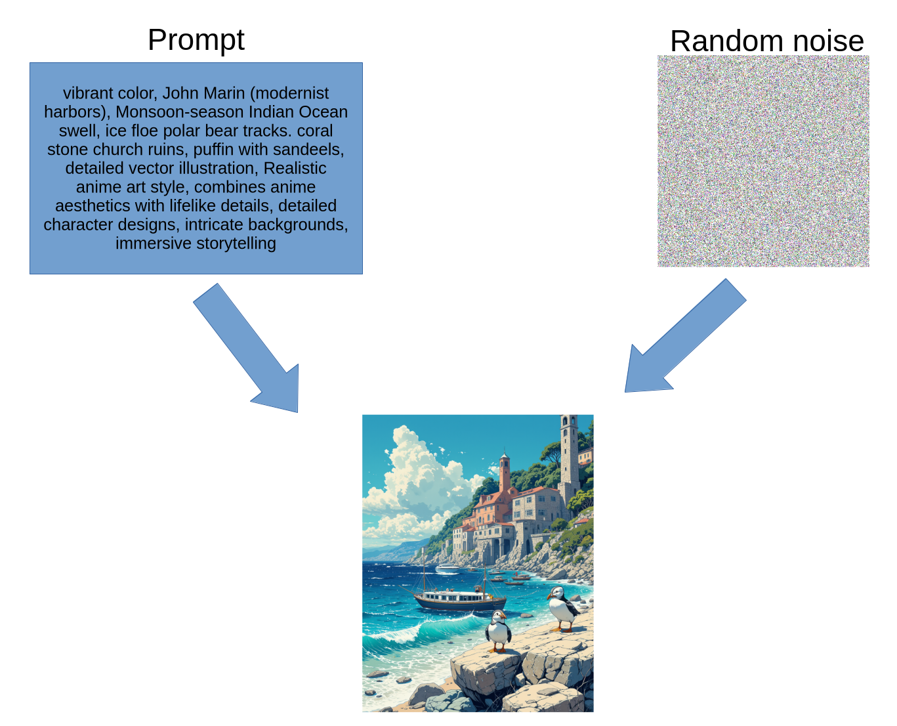
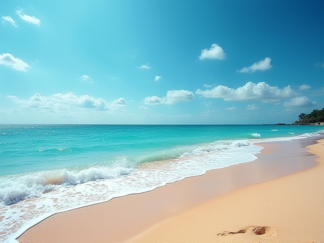
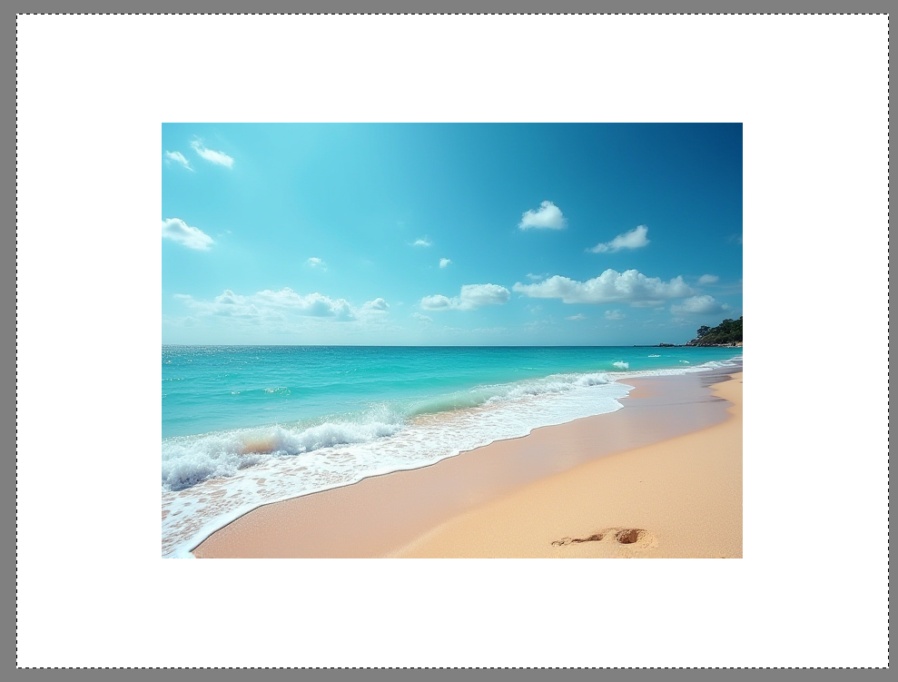
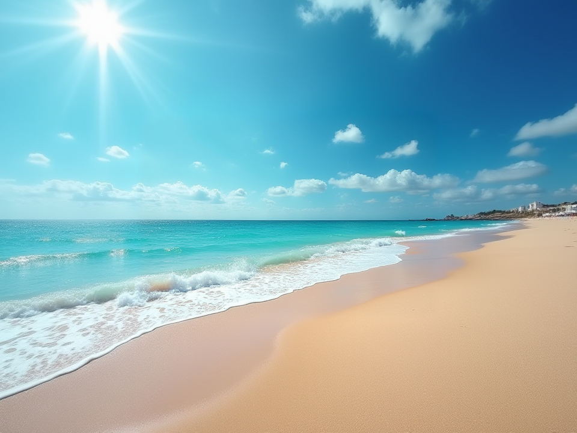

# Threading between Pixel und Prompt - Image editing meets AI magic

Khôi Tran / kt@compile.ch

TODO make a image

---

## This presentation in a nutshell

Lighthearted presentation about something else than LLMs.

Let's talk about image generation and editing with AI.

---

## How are images generated using AI?

One buzzword: Stable Diffusion!

---

## Evolution of Models

From SD to cutting-edge alternatives

### Stable Diffusion 1.5 (SD)
- The classic - 512x512 images
- Fast, efficient, runs on modest hardware
- Huge library of community fine-tunes

### Stable Diffusion XL (SDXL)
- Higher resolution - 1024x1024 native
- Better prompt understanding and detail
- Requires more VRAM (~6-8GB+)

### Flux
- New architecture from Black Forest Labs (original SD creators)
- Superior prompt adherence and realism
- Multiple variants: schnell (fast), dev (quality), pro (best)

### Qwen
- Multimodal model from Alibaba Cloud
- Strong at text rendering in images
- Versatile across multiple languages

---

## Availability

Pretrained checkpoints, LoRA, etc. are available under:

- https://huggingface.co/models?pipeline_tag=text-to-image
- https://civitai.com/images

---

# ... but that's all nice, but kinda hard to use!

---

## Accessiblity Level 1: ComfyUI

Node-based workflow for Stable Diffusion

- Visual programming interface for AI image generation
- Build complex workflows with simple drag-and-drop
- See exactly what each step does
- Save and share workflows as JSON files

---

## Accessibility Level 2: Krita AI

AI generation meets professional digital painting

- **Native Integration**: AI tools directly in your painting workflow
- **Artist-First Design**: Built for creators, not engineers
- **Inpainting & Outpainting**: Edit specific regions or extend your canvas
- **Layer-Aware**: Work with selections, masks, and layers seamlessly
- **Multiple Backends**: Connect to ComfyUI, local models, or cloud services

---

## Why Krita + AI?

The best of both worlds

### Traditional Digital Art
- Professional-grade painting tools
- Brush engines, layers, filters
- Non-destructive workflow

### + AI Superpowers
- Generate base compositions quickly
- Fill in backgrounds or details
- Explore variations without starting over
- Speed up repetitive tasks

**Result**: Artist stays in control, AI handles the grunt work

---

## DEMO setup

<pre class="mermaid">
graph TD
subgraph Laptop["💻 Laptop"]
    Krita["Krita + AI Diffusion Plugin"]
end

subgraph Home["Desktop"]
    GPU["NVIDIA RTX 4080"]
    ComfyUI["ComfyUI"]
    Models["SD Models SDXL, Flux, etc."]
end

Krita-->ComfyUI
ComfyUI-->Models-->GPU

</pre>

---

# DEMO Krita + krita-ai-diffusion plugin

https://github.com/Acly/krita-ai-diffusion

---

## DEMO 1: Simple generation

Flux: `Sunny, summer, beach`

---

## DEMO 2: Extend image (Outpainting)

Flux: `Sunny, summer, beach`

⇨

---

## Demo 3: Add / Change Details (Inpainting)

⇨

---

## Demo 4: Reference Layers

TODO Image

---

## Demo 5: Poses

TODO Image

---

## Demo 6: Reference Images

TODO Image